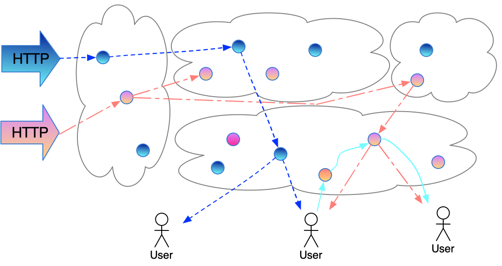
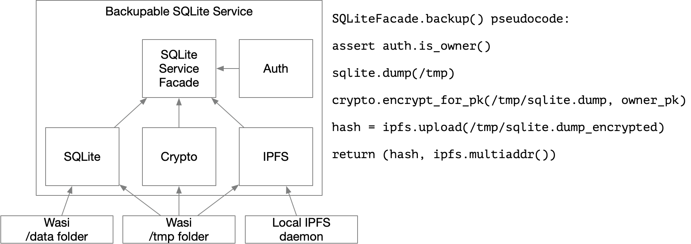
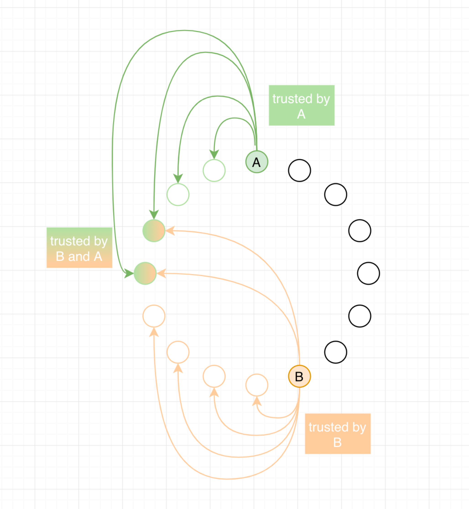
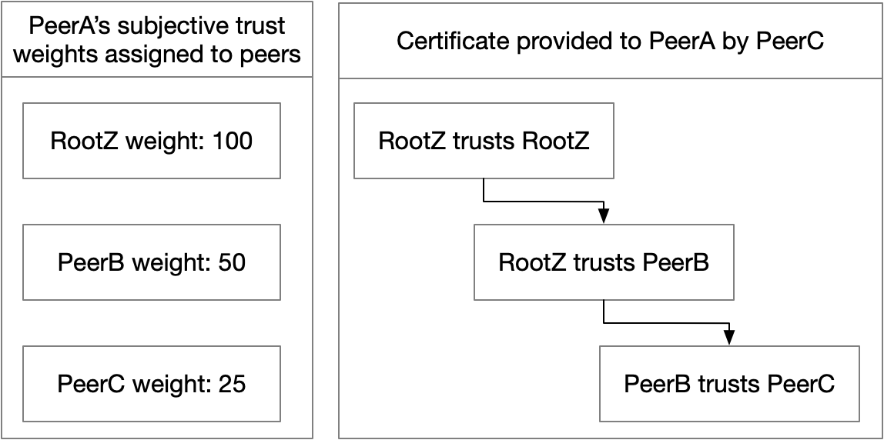

# The Fluence Distributed Computing Protocol


After decades of accelerating evolution, the limitations of client-server architecture are finally impeding software development. Applications now must be built to accommodate multi-user scenarios, multiple devices per user, global access, cross-product features, and real-time user experiences. To serve millions of users and securely serve user data, applications must scale quickly. Meeting these requirements at scale demands non-trivial solutions and top-talent engineering teams. So despite all of the technical innovations over the past decades, the cost and effort required to build new apps is at its peak since the Web was invented.

Security considerations for client-server architecture drive the need to deploy highly complex backends behind cloud walls. Every independent application builds its own castle of services and data, often because there is no other way to enable data sharing between users or reliably use external services. Dividing applications into public and private environments makes harder the integration of external APIs and interconnection of applications, increasing the barriers to building competitive products.
 
These architecture limitations demand a new paradigm where the distributed composition means are incorporated into network protocols.

Fluence’s solution is based on an open, peer to peer protocol to run and compose software. Fluence expands the client-server architecture and provides a unified way to combine and manage distributed components, both internal microservices and external web APIs, into a single application. Fluence’s goal is to make the distributed execution steps from machine to machine, from vendor to vendor, from peer to peer as easily as “;” between lines of code, efficient on runtime, and with [robust security](https://www.ndm.net/firewall/pdf/palo_alto/Forrester-No-More-Chewy-Centers.pdf). Fluence presents Aquamarine, a network-native programming language specially designed as a primary composition tool that converts complex distributed systems into language primitives.

Aquamarine liberates the innovation concentrated in the “glue code” of complex backends. Distributed systems orchestration is commoditized, and the application development is simplified to a handful of scripts managing remote services. Composability is enabled for both private microservices and public APIs, allowing them to speak the same language and leaving security to the Fluence protocol.

Fluence enables a new kind of open applications that can build on each other and share data and users. Such applications are hosted by providers running Fluence nodes, and can reuse the same services with Aquamarine scripts. They are easier to build, can evolve quickly with collaborative effort, and follow an innovation pace as fast as [blockchain-enabled applications](https://denisnazarov.com/what-comes-after-open-source) (DeFi), but without blockchain scalability limitations.


Existing internet services can benefit from Fluence by having a new, simple design with improved reliability, security, and scale. Similarly to open applications, the entire integration layer can be created with the unified protocol between Web APIs, microservices and devices. These integrations simplify the development and expand the potential customer base for existing online products, open source projects, and enterprises.

Below we discuss the main aspects of the Fluence protocol and how the pieces work together to provide a new and greatly enhanced developer experience for building applications.


## Application design


One of Fluence’s primary innovations is to allow the application architecture to have a flexible and custom security perimeter that includes both private and public components. A developer can use Fluence to draw a new security perimeter around the required components to make them work as a single application. Fluence considers these components and the set of distributed execution flows over them as an application. Every flow describes which services must be called and how data must be transferred between them to implement a specific part of the application’s business logic. Services may reside on different cloud platforms, vendors, or servers but communicate with each other over a common protocol.



Packets with the execution flow travel from peer to peer in the Fluence Network. On every peer, services make computations and perform effects: change state and call external APIs. Only the peers and services authorized to handle the request participate in its handling and no intermediary is able to change the execution flow or data.


The execution flow is expressed with the scriptable Aquamarine language that runs on all peers participating in the application execution. Aquamarine scripts can be sent from the client or triggered by any external event (e.g. HTTP request).


To compose the backend, developers can plug in existing services like cloud deployments or access external APIs. If a required service or API is missing, it can be implemented and added to the Fluence network as a new WebAssembly program. These Wasm services can be run by any peer and the network is capable of delivering them closer to the corresponding data to achieve the best performance.


The peer discovery, service discovery and user authentication are provided by the protocol. The network uses a shared state to store addresses, backend configurations, and access rights. The shared state includes a distributed hash table (“DHT”) and an address book, a TrustGraph for decentralized public key infrastructure (“DPKI”), and a consistent common knowledge layer for [non-monotonic](https://m-cacm.acm.org/magazines/2020/9/246941-keeping-calm/fulltext) data like security perimeter configuration and accounting. 

## Aquamarine

Aquamarine is a programming language designed to program an application’s business logic in terms of a distributed network. Aquamarine’s focus as a language and runtime is not computations or data: it is choreography. It provides a network level abstraction and is used to express what services to call, in what order, how to transmit data between them, and how to treat errors.


Aquamarine acts as a messaging medium, a glue for services. If computations are needed on the way, they can be expressed as Wasm services or functions. The same holds for effects: they are expressed as service calls.


Aquamarine is based on the [pi-calculus](https://en.wikipedia.org/wiki/%CE%A0-calculus) – the theory for process coordination. It is extended with data getters to construct arguments of a new service call from the previous ones.


Higher-level representation of Aquamarine may vary, but capabilities are best understood with the intermediary representation: what can be expressed natively and how it is executed. Aquamarine Intermediary Representation (AIR) is an Abstract Syntax Tree. We use [S-expressions](https://en.wikipedia.org/wiki/S-expression) for human readability of the AIR code.


### Composition example

Aquamarine’s goal is to make service composition, choreography of service calls, and passing requests between peers easy to express, process, and understand. Note that some components of the Fluence protocol itself and the AIR environment are written in AIR. Below is an example of AIR for the messenger application, and the corresponding high-level Aqua script.


AIR
```
(seq
  ; Load arguments (relay's peer ID, chat app ID, message data) from the client
  (seq
    (call %init_peer_id% ("load" "relay") [] relay)
    (seq
      (call %init_peer_id% ("load" "chat_id") [] chat_id)
      (call %init_peer_id% ("load" "message") [] message)
    )
  )
  (seq 
    (call relay ("app" "resolve_backend") [chat_id] backend)
    (seq
      (call backend.$.members "is_member" [] is_member)
      (xor
        (seq
          (mismatch is_member true)
          (call %init_peer_id ("chat" "error") ["Cannot send a message to the chat"])
        )
        (seq
          (call backend.$.members "list" [] peers)
          (seq
            (fold peers p
              (par
                (seq
                  (mismatch p %init_peer_id%)
                  (call p ("chat" "message") [message] acc[])
                )
                (next p)
              )
            )
            (seq
              (call backend.$.history ("op" identity) [])
              (seq
                (match acc.length 2)
                (call %init_peer_id ("chat" "delivered"))
              )
            )
          )
        )
      )
    )
  )
)
```

Aqua script
```
def chat_id, message, relay

{members, history} <- relay.resolve_backend(chat_id)

is_member <- members.is_member(sender)

if not is_member:
  sender.error("Cannot send a message to the chat")

par:
  history.message_sent(message)
|
  peers <- members.list()
  for par p <- peers if p != sender:
    acc[] <- p.chat.message(message)
  history.protocol.noop()
  if acc.length == 2:
    sender.chat.delivered()
```

    

  

This script involves several parties in a single experience of sending a message to a group chat. The parties are: sending peer, other chat’s participants, list of participants service, and a chat history service. First, the script requires the verification if the sender is a member of the chat room, then saves the message to the history and sends the message as an update to all online peers from the group.


Usually, such a complex scenario requires considerable coordination between services responsible for access rights, message history, and notifications. Aqua scripts, however,  elegantly constitute the high-level logic without going into service internals, and the protocol handles security and coordination.


As Aqua scripts effectively abstract out the services they operate with, it is beneficial for the community to share and reuse them for different applications and environments. Developers might build different chat applications using the same scripts but replace the services corresponding to the format. Using APIs and microservices becomes much easier with all the wrappers, authentication, and failure handling abstracted out by the language primitives.


### Flow of AIR processing


The AIR script describes which functions to call on which peers, and  unwinds over the peers of the Fluence network in the form of a Particle: a network package that holds AIR during the processing flow.


```
Particle{
  metadata: initiator_peer_pk, signature, timestamp; immutable
  script: AIR script; immutable
  data: Verifiable Data Structure; changed during processing
} 
```

AIR processing is accomplished in "fire and forget" manner: a peer receives a Particle, handles it, updates `data` with the execution results, and, if further processing is needed, forwards the Particle. The `data` is augmented on the way: results of called services are added to the `data` field in the format that is supported by subsequent peers. The `data` does not grow all the time: if the AIR flow reaches the step when some parts of data are not needed any more, this data can be replaced with its proofs (e.g. Merkle-proofs).

```
process_on_peer: Particle{metadata, script, data} -> List<next peer PKs>, Particle{metadata, script, data'}
```

Metadata contains a `timestamp`, `ttl` and `max_hops` to protect the network from amplification, replay attacks, and for garbage collection.

### Peers authorization


The Fluence protocol covers two aspects of authorization: the authorization of AIR flow, and the application level authorization. Authentication is done on the transport protocol layer with peer’s signatures.


AIR flow level authorization means that all the peers and services know that they participate in the same security perimeter. This security perimeter is common knowledge and kept in a shared network state. Any service trusts the input that comes from another service in a flow as much as it trusts direct requests from users.


Application level authorization means permission management of a peer in the context of a security perimeter. It is a part of protocol and requires common knowledge: all services inside the perimeter must expect the same mechanics for authorizing users.


Both authorization types require some common knowledge to be shared between all the peers participating in the flow of a Particle. Services provided by different peers must know that they share the same security perimeter in order to trust each other's output. And they need to derive the evidence that the peer that initiated the request and created a Particle had proper application-level permissions. 


## Network overview
This requires more features from the protocol:
* Executing and calling  services (Fluence Compute Engine)
* Permissions management (TrustGraph)
* Peer connectivity (DHT)
* Consistent shared storage of security perimeters and authorization challenges (Consensus)


Below we discuss other components of the Fluence Protocol that are necessary to address / incorporate all of these key features. 


### Fluence Compute Engine (FCE)

FCE is designed to run services in the Fluence network and provide connectors to external applications, APIs, or microservices. FCE runs services as WebAssembly modules and exposes their public interfaces into the Fluence network. While Aquamarine is designed to facilitate choreography, FCE provides computations, state changes, and converts external APIs into a secure, Aquamarine-composable form.


WebAssembly is an efficient and secure universal binary format that acts as a compilation target for a variety of languages. Perfectly isolated Wasm modules are pure functions that have no effects so they are safe to run on remote machines and even in browsers. Wasm’s portability and isolation allows it to achieve better performance by distributing and executing Wasm modules close to data.


Wasm modules with effects are provisioned by peer owners. Every peer may tell the network what effectors they are ready to provide, and the developer may augment these effectors with additional modules to get a full featured service. Such modules may include connectors to databases, storage, APIs, blockchain nodes, etc.



In this example, a service is composed from five modules, linked together within FCE.


WebAssembly modules express their interfaces with WIT (WebAssembly Interface Types), a universal format that describes how to pass arguments inside a binary, call a function, and receive results. This format is very simple and often can be [derived from the source code of a module](https://github.com/fluencelabs/rust-sdk/blob/589daaea45fa1caafa9f1b973a1b4d24b7642d72/crates/wit/src/parse_macro_input.rs#L28).


WebAssembly Interface Types provide a consistent API for services and also link modules together to form a service. This linking enables the independence of module lifecycles and variability of the execution environment: a useful algorithm, coded in any Wasm-compiled language, can be reused in different services. Services can easily be extended or altered by re-composing modules (adding or altering).

### TrustGraph: a DPKI

To describe relationships between peers on the decentralized network, Fluence uses a method similar to the [Web of Trust](https://en.wikipedia.org/wiki/Web_of_trust) concept. Peers are identified by their Public Keys. Cryptographic signatures are used to authenticate network messages and to protect transmitted data from unauthorized changes.

  



Direct relationships between peers constitute Trust and a collection of such relationships forms a graph: the TrustGraph. If a peer “trusts'' another peer, it forms an edge in the TrustGraph, which is represented as a cryptographically proven entity that tethers two Peer IDs. 



A sequence of Trusts forms a Certificate. Certificates are particularly useful as they allow you to manage trust relationships not knowing all peers in advance: if PeerA explicitly trusts RootZ, it means PeerA trusts other yet-unknown peers trusted by RootZ – but to a lesser extent.  

The list of trusted authorities is subjective for every peer. Derived weights are used for connectivity prioritization: peers with higher weight are less likely to be evicted from the address book.

Trust relationships are used for managing connectivity and permissions. By issuing trust, peers can prioritize connections to key gateways or get better connectivity between peers owned by a particular company. 

Permissions to access services also can be expressed as trust edges. Peers may trust application developers and execute their backends on peer’ resources.  End-users, holding a certificate issued by the developer, will be served by network peers without explicitly delivering user identifiers to peers.


### DHT and Connectivity
As a peer-to-peer protocol, Fluence is highly focused on the ability for peers to interact and on the reliability of their connectivity. Establishing an interaction requires peers to exchange public keys and/or internet addresses.


Fluence's DHT (Distributed HashTable) is a network-wide shared state used to find, choose, and connect peers. It is based on [Kademlia algorithm](https://en.wikipedia.org/wiki/Kademlia) and inherits the common routines: deriving keys from public keys, XOR distance metric, periodic republishing of DHT data to support network restructuring, etc.


In the Fluence network, DHT keys play the role of attribute identifiers. Peers register themselves to keys as providers of an attribute so that they can be grouped and resolved by a DHT key. Examples of attributes are:
* Peers providing access to a certain effect or library, like participants of the Fluence network providing access to IPFS network through the Fluence protocol,
* Peers serving as a relay for a non-connectable client, like browser or mobile phone,
* Participants of some topic, e.g. members of a chat room, or collaborators of a document,
* Seed peers of a subnetwork – a fraction of Fluence network which is too big to fit into a single DHT key.


To protect DHT from unauthorized writes, each key is bundled together with a challenge that a provider (writer to a DHT key) must solve. The solution is a canonical value for the key.

```
dht_key = hash(challenge)
add_provider(challenge, provider, solution)
```

These solutions may utilize TrustGraph. An example is effector service providers, or computing pool attribution: all peers with Trust from a particular public key are considered authorized to register themselves to a key. In this case, the challenge is that PK and some nonse.

```
owned_key_challenge = concat(owner_pk, max_trust_path_length, nonce)
owned_key_solution = path(owner_pk, provider_pk)
```

Providers are ordered by trust weight, and the number of providers per key is limited. Fluence also allocates a reserve for peers with no trust weight.

### Consensus

The Fluence protocol provides ways to perform coordination of a fraction of the network:
* Aquamarine script coordinates the flow involving only the peers with certain services,
* DHT coordinates replication of the part of the network that is in the key's Kademlia neighborhood,


This partial coordination solves many problems, but several remain that require coordination of the whole network to have a common knowledge with known finality guarantees. These problems include:
* Synchronization of a security perimeter between all peers providing services included into that
* Proof of revocation of trust relationships in TrustGraph
* Global identifiers, for example, to associate a name or ID with a DHT key,
* Financial relationships between peers: balances and licensing,


The Fluence network includes a consensus layer to ensure that all peers have the same knowledge about this state and its transitions. The consensus layer requires implementing a blockchain that manages a consistent distributed state among network peers. We discuss consensus in more detail in the economy paper as it is being used also for on-chain licensing and payments.

## Conclusion


We designed Fluence to overcome the limitations of client-server architecture and enable continued innovation of internet applications. Fluence moves authentication to the network protocol layer and allows the expression of complex distributed systems as language primitives, simplifying the creation of many web applications. The protocol components (FCE, DHT, TrustGraph, Consensus layer) combined together compose a unique developer experience expressed in Aquamarine, opening new distributed application architectures.


Open collaboration around the composition layer will catalyze more innovation than ever possible in either a proprietary cloud ecosystem or even the largest technology firms. The World Wide Web has supercharged humanity's progress by letting people freely collaborate, share ideas, and reuse each other's work. Over time, the Web evolved from static page websites to comprehensive dynamic applications but has almost lost its original composability capabilities as large technology companies have created dominant proprietary ecosystems. Fluence restores internet composability, empowering developers and powering the web of applications.

The flexibility of Fluence’s architecture enables additional economic models that advance beyond today’s legacy SaaS and advertising based revenue. These new business models are based on digital licensing for the applications’ usage over the network and are possible due to the consensus layer which tracks the financial relationships of the service providers and users. This economic opportunity complements the open, customizable and composable Fluence architecture and will help accelerate software innovation.
